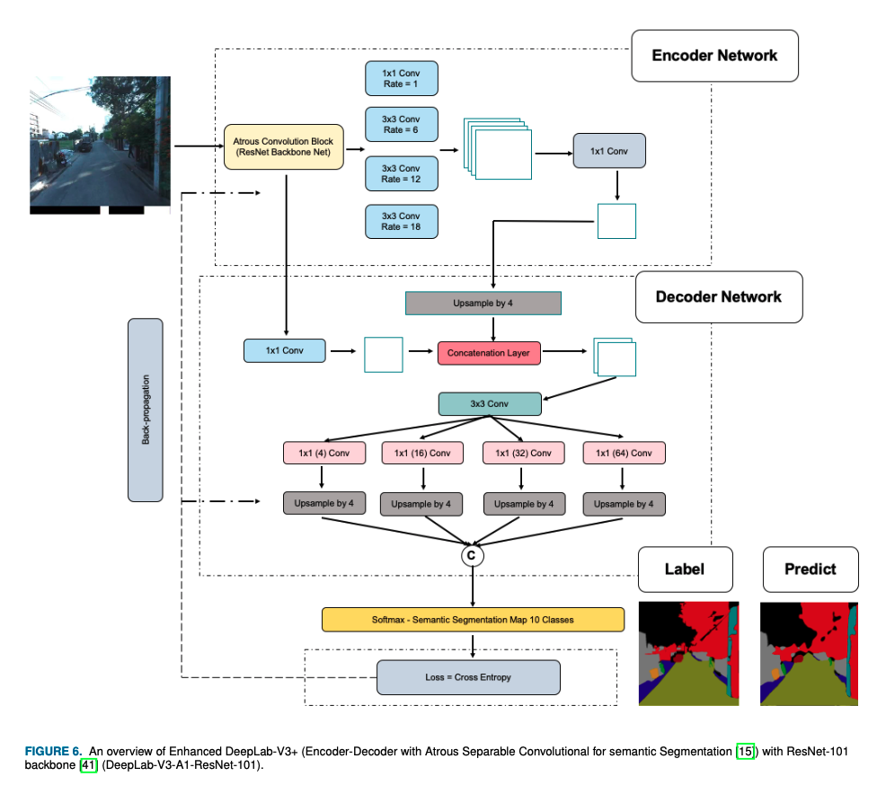
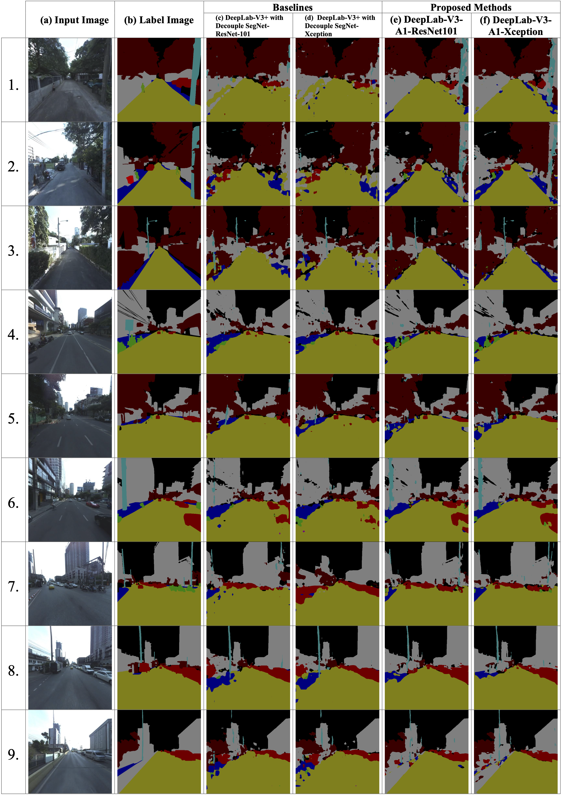
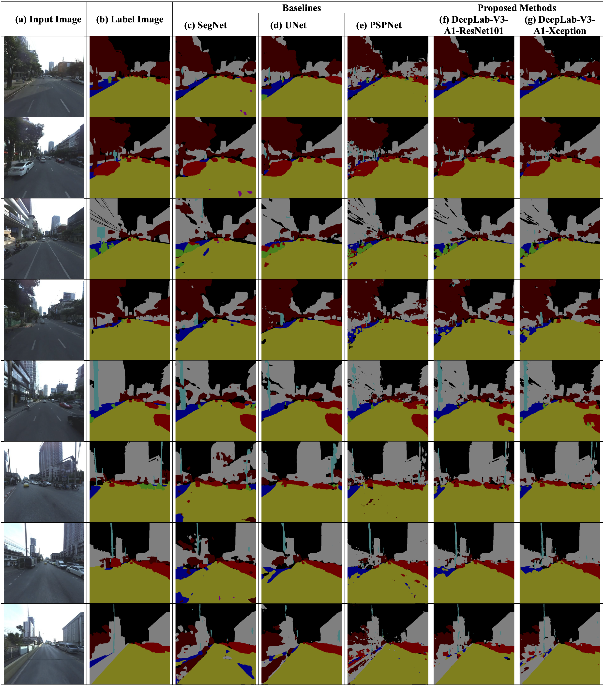
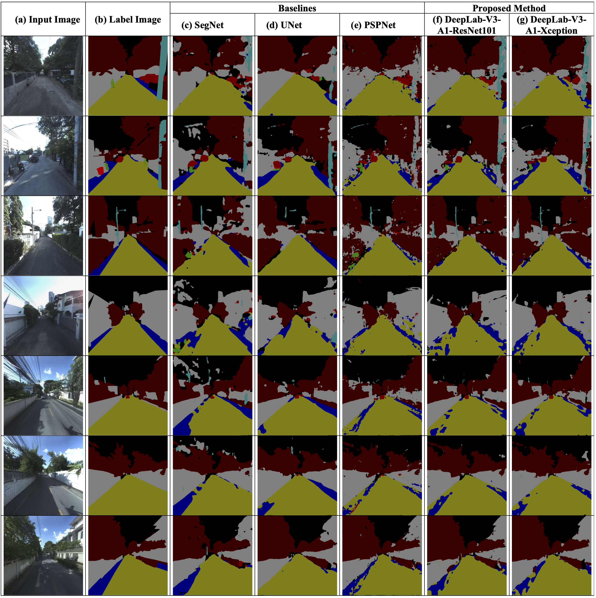
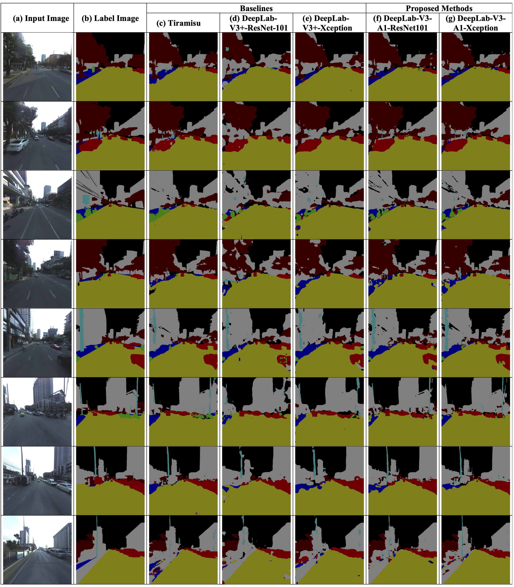
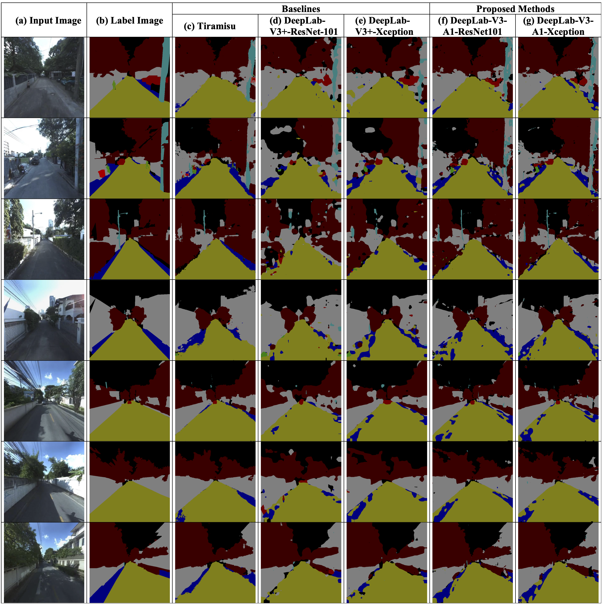

# The Bangkok Urbanscapes Dataset for Semantic Urban Scene Understanding Using Enhanced Encoder-Decoder with Atrous Depthwise Separable A1 Convolutional Neural Networks (IEEE Access'22-(Major Revision))

[KITSAPHON THITISIRIWECH](https://th.linkedin.com/in/kitsaphon-thitisiriwech),
[TEERAPONG PANBOONYUEN](https://kaopanboonyuen.github.io/),
[PITTIPOL KANTAVAT](https://s.isanook.com/mv/0/ui/3/16875/17216_002.jpg),
[YUJI IWAHORI](https://s.isanook.com/mv/0/ui/3/16875/17216_002.jpg),
[BOONSERM KIJSIRIKUL](https://s.isanook.com/mv/0/ui/3/16875/17216_002.jpg)

**[Paper Link](https://github.com/kaopanboonyuen/bkkurbanscapes)** | **[Project Page](https://kaopanboonyuen.github.io/bkkurbanscapes/)** 


> **Abstract:**
>*Semantic segmentation is one of the computer vision tasks which is widely researched at present. It plays an essential role to adapt and apply for real-world use-cases, including the application with autonomous driving systems. To further study self-driving cars in Thailand, we provide both the proposed methods and the proposed dataset in this paper. In the proposed method, we contribute Deeplab-V3-A1 with Xception, which is an extension of DeepLab-V3+ architecture. Our proposed method as DeepLab-V3-A1 with Xception is enhanced by the different number of 1 x 1 convolution layers on the decoder side and refining the image classification backbone with modification of the Xception model. The experiment was conducted on three datasets: the proposed dataset and two public datasets i.e., the CamVid, the cityscapes, and IDD datasets, respectively. The results show that our proposed strategy as DeepLab-V3-A1 with Xception performs comparably to the baseline methods for all corpora including measurement units such as mean IoU, F1 score, Precision, and Recall. In addition, we benchmark DeepLab-V3-A1 with Xception on the testing set of the cityscapes dataset with a mean IoU of xx.xx%. For our proposed dataset, we first contribute the Bangkok Urbanscapes dataset, the urban scenes in Southeast Asia. This dataset contains the pair of input images and annotated labels for 701 images. Our dataset consists of various driving environments in Bangkok, as shown for eleven semantic classes (Road, Building, Tree, Car, Footpath, Motorcycle, Pole, Person, Trash, Crosswalk, and Misc). We hope that our architecture and our dataset would help self-driving autonomous developers improve systems for driving in many cities with unique traffic and driving conditions similar to Bangkok and elsewhere in Thailand.*


<!-- <p align="center">
  
</p> -->


## Usage & Data
Refer to `requirements.txt` for installing all python dependencies. We use python 3.7 with pytorch 1.7.1. 

We download the official version of CityScapes from [here](https://www.cityscapes-dataset.com/) and images are resized using code [here](https://github.com/open-mmlab/mmaction2/tree/master/tools/data/kinetics).


## Model Training
For pre-training on models on the CityScapes dataset, use the scripts in the `scripts` directory as follows. Change the paths to dataset as required. 

```
./scripts/train.sh
``` 


## Downstream Evaluation
Scripts to perform evaluation (linear or knn) on selected downstream tasks are as below. Paths to datasets and pre-trained models must be set appropriately. Note that in the case of linear evaluation, a linear layer will be fine-tuned on the new dataset and this training can be time-consuming on a single GPU.  

```
./scripts/eval_linear.sh
./scripts/eval_knn.sh
``` 


## Pretrained Models
Our pre-trained models can be found under [releases](https://github.com/bkkurbanscapes/).

## Results








## Citation

```bibtex
@article{panboonyuen2017road,
  title={Road segmentation of remotely-sensed images using deep convolutional neural networks with landscape metrics and conditional random fields},
  author={Panboonyuen, Teerapong},
  journal={Remote Sensing},
  volume={9},
  number={7},
  pages={680},
  year={2017},
  publisher={Multidisciplinary Digital Publishing Institute}
}
```


## Acknowledgements
Our code is based on [TensorFLow](https://www.tensorflow.org/tutorials/images/segmentation) and [SegmentationModels](https://github.com/qubvel/segmentation_models) repositories. We thank the authors for releasing their code. If you use our model, please consider citing these works as well.
